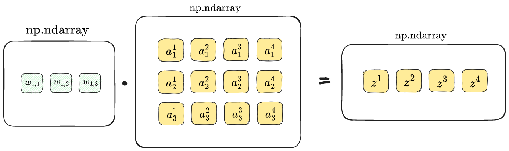
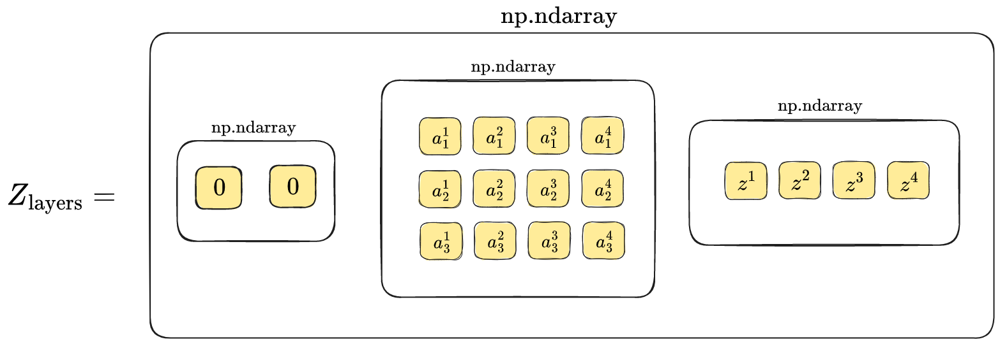
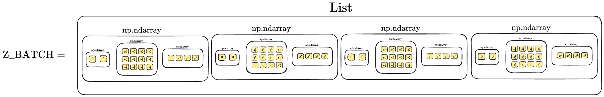

# Neural Network from Scratch

Neural Network built from scratch using [Numpy](https://numpy.org/).


This project was done for educational purposes only. It may not be very efficient and possible have numerous poor coding practices, but I intend to get better as I learn.

The goal of this project was to understand and implement the mathematics behind the operation and training of Neural Networks and train it to solve a simple problem.

Note: The implementation of the Neural Network was inspired from [Pytorch](https://pytorch.org).


This Neural Network was used on two problems:
- [Approximating a XOR gate](xor_problem_test.py)
- [Recognizing handwritten digits from images](digit_recognition_test.py)


# Neural Network

The main Neural Network implementation is in the file [NeuralNetwork.py](NeuralNetwork.py).


## Google Colab Notebooks

To access the Google Colab Notebook that demonstrates the trained Neural Network on **XOR Gate problem**, click [here](https://colab.research.google.com/github/gluten-morgen/Neural_Network_from_Scratch/blob/master/xor_problem_test.ipynb), or **open this file to view the code and outputs**: [xor_problem_test.ipynb](xor_problem_test.ipynb)


To access the Google Colab notebook that demonstrates the trained Neural Network on **MNIST handwritten digit recognition**, click [here](https://colab.research.google.com/github/gluten-morgen/Neural_Network_from_Scratch/blob/master/digit_recognition_test.ipynb), or **open this file to view the code and outputs**: [digit_recognition_test.ipynb](digit_recognition_test.ipynb)


# Libraries Used

The module `NeuralNetwork` uses the following libraries:

```
numpy
concurrent.futures
math
pickle
matplotlib.pyplot
warnings
```

Note that `np` is used as an alias for `numpy` in the document from here onwards.

# Architecture

Here is an illustration showing a simple Neural Network architecture.


# Data Structures

This is an illustration of the data structures used in the Neural Network.

## Weights

An illustration of the data structure used to store the weights in the network. 
The Weights are stored as a `list` of numpy arrays, or `np.ndarray`.


## Batches

Operations are performed on all batches containing $m$ samples of data. When an operation such as,

$$Z = W X^T + b$$

where,

$Z$ is the weighted sum of the inputs.

$X$ are the inputs.

$b$ is the bias (taken as $0$ in this example).


Running the linear weighted sums $Z$ through an *Activation function*, $\sigma(Z)$:

$$A = \sigma(Z)$$

Thus, for the next layer,




All the weighted sums $Z$ from both operations are then stored in a `np.ndarray`. An array of zeros are added in place of the *input* layer for standardization in indexing for different operations.



Each of the $Z_\text{layers}$ corresponding to a single batch are stored in a `list`. Note that the output of the above operation is transposed before storing into the list.




# Usage

## Initialize the Layers

Create layers by initializing a new `NeuralNetwork.NN` object.

```
from NeuralNetwork import NN

layer1 = NN(inputs=2, outputs=3, activation='relu') # input layer
layer2 = NN(inputs=3, outputs=3, activation='relu') # hidden layer

# ... add hidden layers as required ...

layer_n = NN(inputs=3, outputs=1, activation='sigmoid') # output layer
```

## Forward Propagation

The `NeuralNetwork.NN.forward()` method forward propagates the inputs through a layer in the network.
It expects a 3-dimensional `np.ndarray` of shape `(k, m, n)` having $k$ batches of $m$ samples, and $n$ inputs.

```
y_hat = layer1.forward(batch_inputs)
y_hat = layer2.forward(y_hat)
y_hat = layer3.forward(y_hat)
```

## Backpropagation

Initialize and create a `NeuralNetwork.NN.Backpropagation` object.

```
back_prop = NN.Backpropagation(loss='MSE')
```

Backpropagate using the `NeuralNetwork.NN.Backpropagation.backward()` function. It is also necessary to use the `clear_gradients()` function to clear all gradients to $0$ after each epoch.

```
back_prop.clear_gradients()
back_prop.backward(y_truth_batch)
```

Note that the `backward()` function expects a 3-dimensional `np.ndarray` containing the actual labels, of shape `(k, m, n)`, having $k$ batches of $m$ samples, and $n$ outputs.


## Weight Update

The weight update is done using the `NeuralNetwork.NN.Optimizer` class. 

Create an object.
```
optim = NN.Optimizer(optimizer='ADAM')
```

The `NeuralNetwork.NN.Optimizer.step()` updates the weights.

```
optim.step()
```


# Saving the Weights

The weights can be saved into a file in the current working directory using the `NeuralNetwork.Utils` class.

Create an object of the `Utils` class.

```
from NeuralNetwork import Utils

utils = Utils()
```

The trained weights can be accessed using `NN.WEIGHTS`.

To save the weights,
```
utils.save_weights(NN.WEIGHTS, filename='trained_weights')
```

